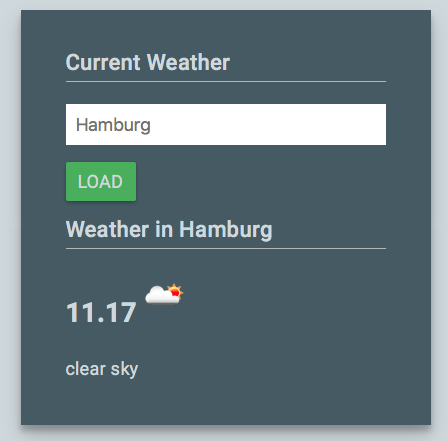

# Clojurescript / React Example

A simple sample that shows the implementation of an React/Flux application with
different Clojurescript frameworks.
 

## Dev Build with Figwheel

    lein figwheel

## Prod Build with Minimization

    lein clean
    lein cljsbuild once min

## Implementation with Reagent / Reframe

[Reagent](https://reagent-project.github.io) / [Reframe](https://github.com/Day8/re-frame)

## Implementation with om.next
[om.next](https://github.com/omcljs/om)